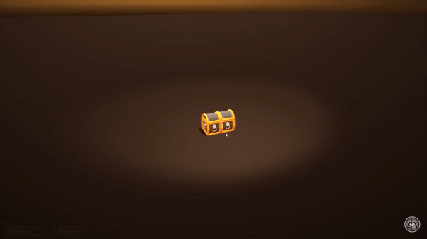

# Object Shattering Particle Effect

Source: https://youtu.be/w4aMtKeD2w4

### How is it unique from existing demos in our class?
This effect is unique because it is tied directly to the object in the scene that we are trying to destroy, which creates the shattering effect that is more realistic than just the explosion itself.
### Features Timeline 
#### Minimum requirements (finish by May 18th):
1. Adding and animating fire explosion particles 
2. Smoke particles exploding outwards from the object
3. Triangular particles of the color of the object exploding outwards from the object
#### Good-to-have (finish by May 19th):
4. Creating and animating fire, smoke, and shattered pieces according to the shape and size of the object
5. Adding object's texture to the triangular particles
#### Stretch (finish by May 20th):
6. Making triangular particles to be 3-dimentional and animated with gravity

### Algorithms, data structures and/or background math:
For this effect, I will be using the general algorithms and data structures that we used for our other particle effects. 
 - for fire explosion: sprite sheet
 - for smoke particles: puff billboard with blending
 - for shattered pieces: object pool
